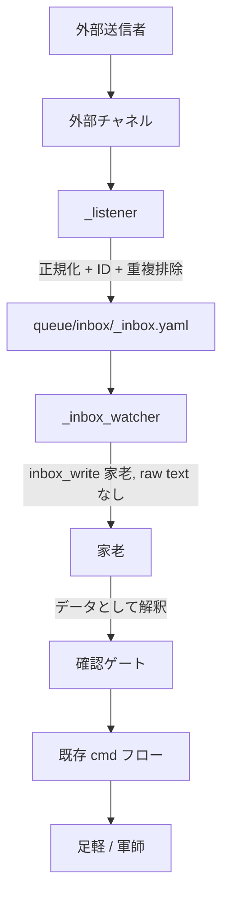

---
codd:
  node_id: "design:external_inputs_overview"
  depends_on: []
  depended_by:
    - id: "design:external_input_inbox_schema"
    - id: "design:external_input_allowlist"
    - id: "design:external_input_intent_parser"
    - id: "design:external_input_karo_flow"
    - id: "design:external_input_google_chat_pubsub"
    - id: "design:external_input_google_chat_workspace_events"
    - id: "design:external_input_google_chat_interaction_events"
    - id: "design:external_input_google_chat_setup_runbook"
---
# 外部入力

## 1. 目的

外部入力は、人間または外部サービスが将軍ターミナルに直接入力することなく、multi-agent-shogun に候補作業を送信できるようにする。
すべての外部入力は、チャネル ID チェック、allowlist チェック、家老解釈、およびすべての必須確認ゲートに合格するまで、信頼できないデータとして扱われる。

Google Chat はチャネル #1。将来のチャネルには Slack、GitHub issue mentions、メール、またはその他のメッセージングシステムが含まれる可能性がある。

## 2. 共通アーキテクチャ



## 3. 共通設計原則

- チャネルリスナーは外部イベントを共通 YAML 形式に正規化。
- チャネル inbox はアーカイブプロセスが導入されるまで append-only 監査キュー。
- ウォッチャーは作業が存在することのみを家老に通知。エージェント pane に raw 外部テキストを送信しない。
- 家老は外部入力が cmd になる前の唯一のインタプリタと承認者。
- プロンプト注入はすべての `text` フィールドで想定。
- ID と allowlist データは信頼できるチャネルメタデータから取得、ディスプレイ名またはメッセージテキストではない。
- シークレット、メールアドレス、クラウドプロジェクト ID、および鍵パスは `config/` から注入され、再利用可能な docs またはスクリプトにハードコードされてはならない。

## 4. チャネルレイアウト

各チャネルは以下を追加すべき：

```text
docs/external_inputs/channels/<channel>/
├── transport.md または pubsub_design.md
├── identity.md または workspace_events.md
└── setup_runbook.md
```

各実装は以下を追加すべき：

```text
scripts/<channel>_listener.py
scripts/<channel>_inbox_watcher.sh
queue/inbox/<channel>_inbox.yaml
config/<channel>_input.yaml または config/<channel>_input.env
```

実装ファイルは例であり、このデザインタスクで作成されない。

## 5. チャネル候補

| チャネル | トリガー | 可能性の高いトランスポート | 注記 |
|---|---|---|---|
| Google Chat | メッセージ、メンション、スレッド返信 | Workspace Events API + Pub/Sub pull | チャネル #1。パブリック HTTPS エンドポイント不要。 |
| Slack | アプリメンション、メッセージイベント | Slack Events API または Socket Mode | Socket Mode はパブリックエンドポイントを回避するが、Slack アプリトークンが必要。 |
| GitHub issue メンション | issue またはコメント内の `@shogun` | GitHub webhook または Actions ワークフロー | リポジトリ バインド作業と監査証跡に最適。 |
| メール | インバウンドメッセージ | IMAP、Gmail API、または webhook bridge | DKIM/ID チェックが明示的でない限り、スプーフィングリスクが高い。 |

## 6. 新しいチャネルの追加

1. チャネル ID フィールドとスプーフィングリスクを定義。
2. チャネルペイロードを `common/inbox_schema.md` にマップ。
3. allowlist 識別子と設定注入形式を決定。
4. `channels/<channel>/` の下にチャネル docs を追加。
5. 後の実装タスクでリスナーとウォッチャーを追加。
6. 受け入れ、拒否、重複、不正形式、高リスク入力のフィクスチャーを追加。
7. このドキュメントルート用に `codd scan`、`codd validate`、および `codd dag verify` を実行。

## 7. 既存入力との関係

既存の電話通知 inbox は本質的に外部入力であるが、このデザインでは再分類されない。
既存の入力ファイルの再分類は、長期運用プロトコルと将軍責任に影響するため、別のコマンドで処理すべき。
